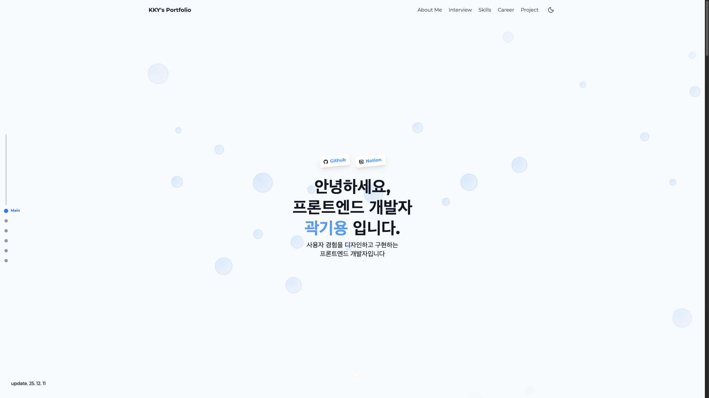
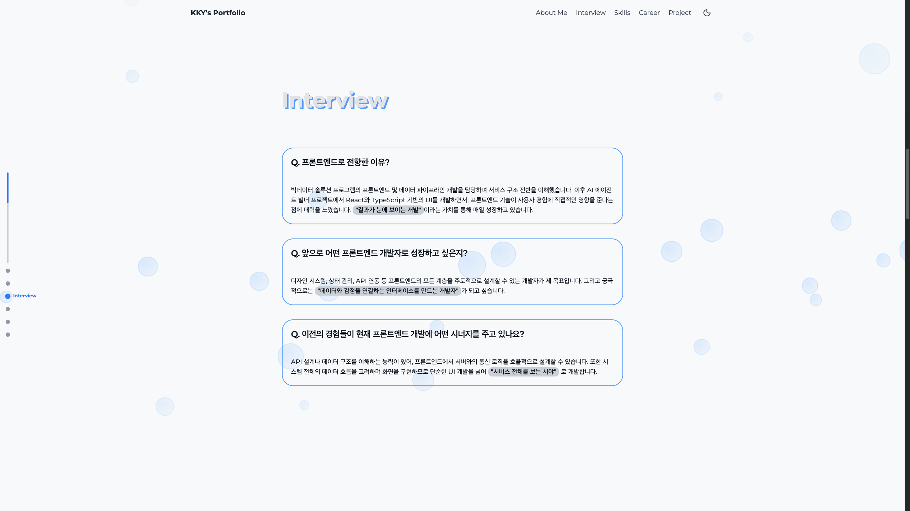
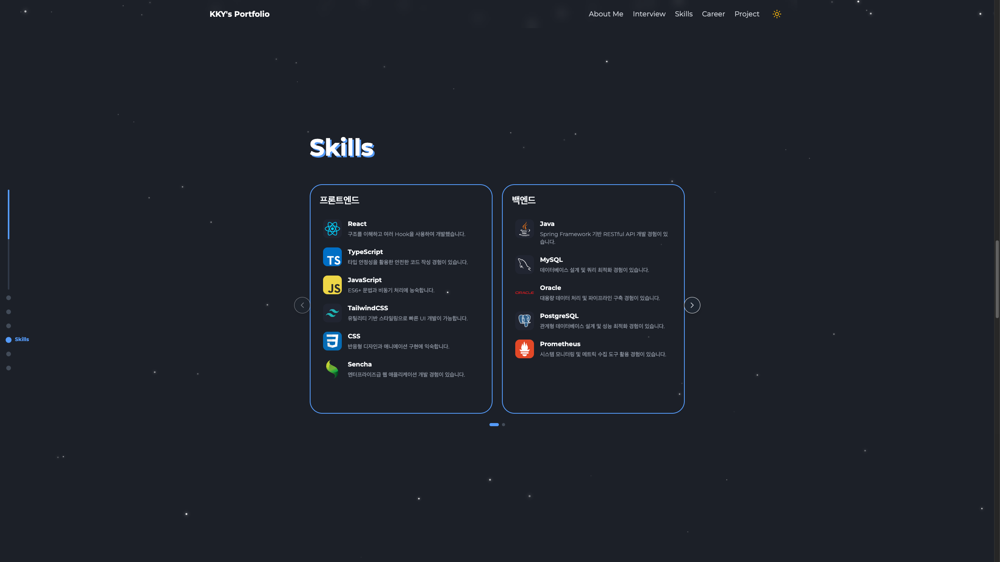
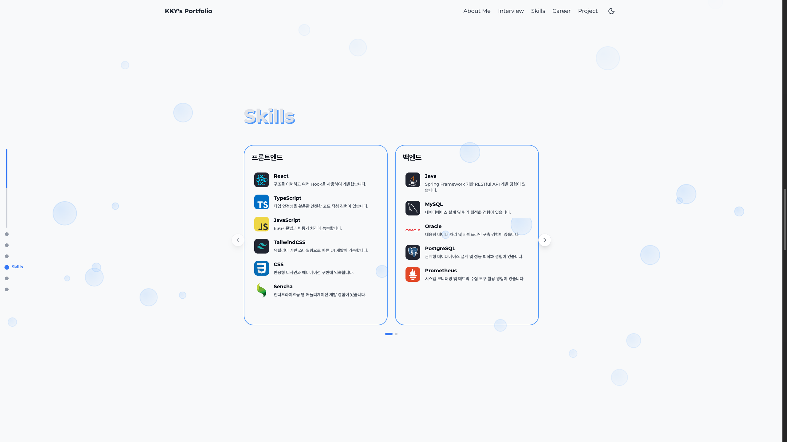

# KKY's Portfolio

## 🔗 배포 링크

> https://kky-portfolio.netlify.app/

## 📋 프로젝트 소개

React와 TypeScript로 만든 프로젝트, 퍼블리싱과 웹표준 등을 고려한 웹 프로젝트, 스크립트, 애니메이션이 담겨져있습니다.

## 🛠️ 기술 스택

- **Frontend**: React 19, TypeScript
- **스타일링**: Tailwind CSS
- **애니메이션**: Framer Motion
- **UI 컴포넌트**: Shadcn UI
- **빌드 도구**: Vite

## ✨ 주요 기능

### 1. 🏠 메인 페이지

첫 화면이 로드되면 각 아이템들이 애니메이션이 적용되어 하나씩 나타납니다. 다크모드 여부에 따라 애니메이션이 변경됩니다.

- 프로필 정보 카드
- 소셜 링크 (GitHub, Notion)
- 스크롤 화살표

- 
### 2. 📌 About Me 페이지

저를 나타내는 페이지이며 저의 자기소개가 담겨져 있습니다.

### 3. 💼 Interview 페이지

프론트엔드 개발자로서의 생각과 경험을 담은 Q&A 페이지입니다.

### 4. 👩‍💻 Skills 페이지

보유한 기술 스택을 카테고리별로 정리한 페이지입니다.

- Carousel 형태의 네비게이션

### 5. 💼 Career 페이지

경력 사항을 카드 형태로 보여주는 페이지입니다.

- 회사별 경력 정보
- 주요 업무 내용
- 사용 기술 스택

### 6. 🚀 Project 페이지

제작한 프로젝트들을 보여주는 페이지입니다.

- 프로젝트별 상세 정보
- 배포 링크 및 Notion 문서 링크
- Hover 애니메이션 효과
- 기술 스택 아이콘

## 🎨 디자인 특징

- **반응형 디자인**: 모바일, 태블릿, 데스크톱 모든 기기에서 최적화
- **다크모드 지원**: 사용자 선호에 따른 테마 전환
- **입체적 타이포그래피**: 제목 텍스트에 3D 효과 적용
- **부드러운 애니메이션**: Framer Motion을 활용한 자연스러운 전환 효과
- **모던한 UI**: Shadcn UI와 Tailwind CSS를 활용한 깔끔한 디자인

## 📱 반응형 디자인

모든 페이지는 다음과 같은 브레이크포인트를 사용합니다:

- **모바일**: 기본 (640px 미만)
- **태블릿**: `sm:` (640px 이상)
- **데스크톱**: `md:` (768px 이상), `lg:` (1024px 이상)